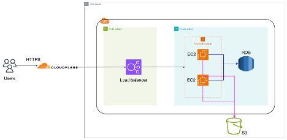

# AWS DevOps Engineer Homework

## Overview

This project demonstrates the deployment of a simple "Hello User" web application on AWS using best practices and Infrastructure as Code with Terraform.

## Architecture

  

<!--  -->