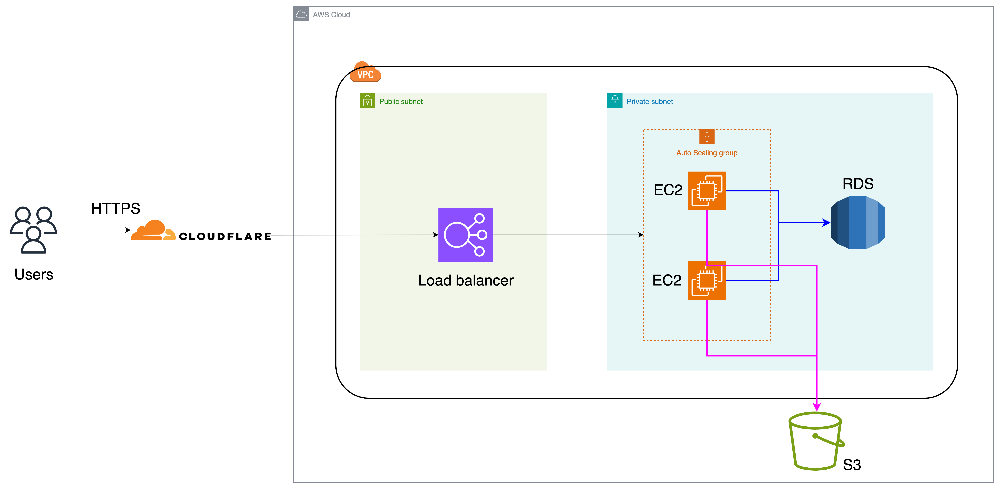

# AWS DevOps Engineer Homework

## Overview

This project demonstrates the deployment of a simple "Hello User" web application on AWS using best practices and Infrastructure as Code with Terraform.

## Architecture

<!-- <p align="center">
  
</p> -->


## System Description

- The application is hosted on **EC2 instances** within a **private subnet**.
- A **Load Balancer (ALB)** is placed in a **public subnet** to route incoming HTTPS traffic to the EC2 instances.
- **Auto Scaling Group (ASG)** ensures high availability and scalability of the EC2 instances.
- The application is a simple Node.js + HTML app that allows users to:
  - Input their name and upload an image.
  - Store the uploaded image on **Amazon S3**.
  - Display a list of users and their images.

Terraform is used to provision the following AWS resources:
- VPC with public/private subnets.
- Internet Gateway, Route Tables, NAT Gateway.
- Security Groups for Load Balancer and EC2.
- Application Load Balancer with target group and listener.
- Launch Template and Auto Scaling Group for EC2 instances.
- IAM roles and S3 bucket for file storage.

## Result

Below is a screenshot of the deployed application:


The application provides a user-friendly interface where users can submit their name and image, and see a list of other submissions.

---

## How to Deploy

Instructions to deploy using Terraform:

```bash
terraform init
terraform plan
terraform apply